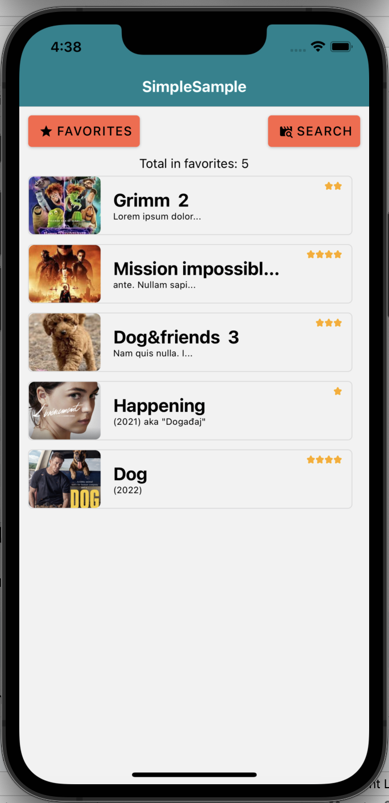
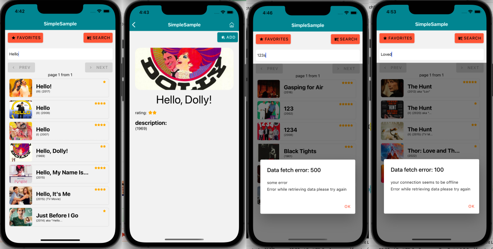

# Simple sample react native app
Very simple app for learning/showcase purpose.


## specification
- movie data from the external APIs ( see [IMDB](src/fetch/ImdbAPI.ts) and  [Mock](src/fetch/mock/MockFetchStrategy.ts) fetch providers)
- initial screen = favorites list (title, movie poster, description and rating)
- search for a specific movie/show
- click on movie -> go to detail screen
- informed if the internet connection is lost or error in fetching - triggered by search action



## setup

Vanilla React (no Expo).
Followed the instruction here [https://reactnative.dev/docs/environment-setup](https://reactnative.dev/docs/environment-setup).

## run

bundler

```
npx react-native start
```

Android

```
npx react-native run-android
```

ios

```
npx react-native run-ios
```

with debugger:
```
REACT_DEBUGGER="open -g 'rndebugger://set-debugger-loc?port=8081' ||" npx react-native run-ios
```

### troubleshooting

clear all and do fresh build:

```
watchman watch-del-all && rm -rf node_modules/ && yarn cache clean && yarn install && yarn start --reset-cache
```

## TODOs
- setup config by environment (for example to switch fetch provider)
- add i18n for translations
- add Jest for testing
- handle secrets for API keys
- use cache for fetching
- proper handling of text resizings
